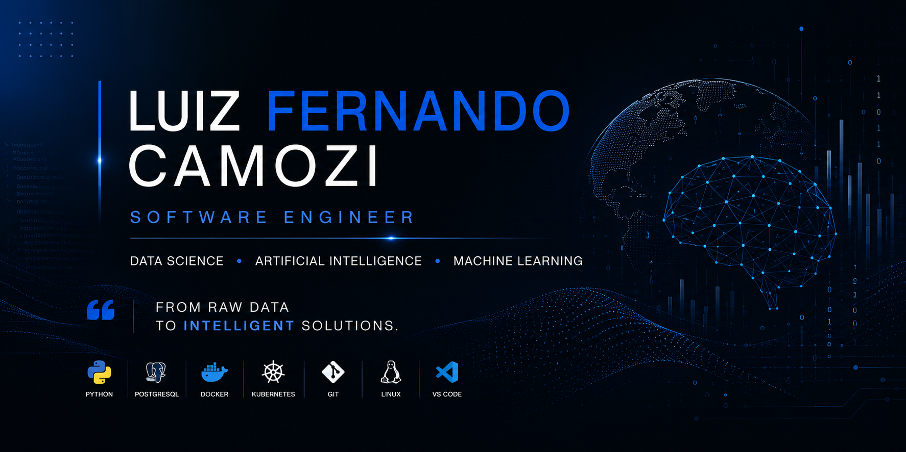

  

# Hi there, I'm Luiz Fernando 👋

## 🚀 About Me

I'm a Software Engineer with a strong interest in **Data Science**, **Artificial Intelligence**, and **Machine Learning**.

I enjoy building intelligent solutions that combine software engineering best practices with data-driven decision making.

Currently, I'm focused on developing a professional portfolio and preparing for international opportunities.

---

## 🎓 Education

- 🎓 Software Engineering
- 🎓 Systems Analysis and Development

---

## 💼 Current Focus

- 📊 Data Science
- 🤖 Artificial Intelligence
- 🧠 Machine Learning
- 🐍 Python
- 🗄️ SQL
- 📈 Data Visualization

---

## ⚙️ Technologies

---

## 🌱 Currently Learning

- Statistics
- Machine Learning
- Deep Learning
- AI Agents
- LLM Applications

---

## 🎯 2026 Goals

- Build a world-class Data Science portfolio
- Become an AI Engineer
- Work with international clients
- Contribute to open source

---

## 📫 Connect with me

- LinkedIn: *((https://www.linkedin.com/in/luiz-fernando-azevedo-666551249/))*

## 📊 GitHub Stats

